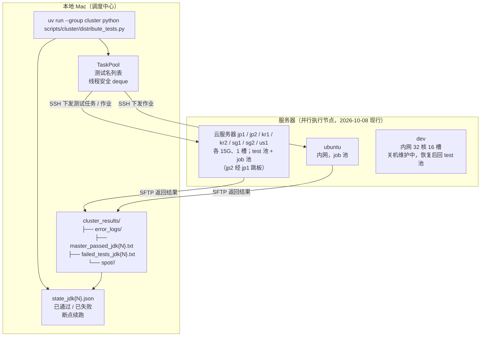
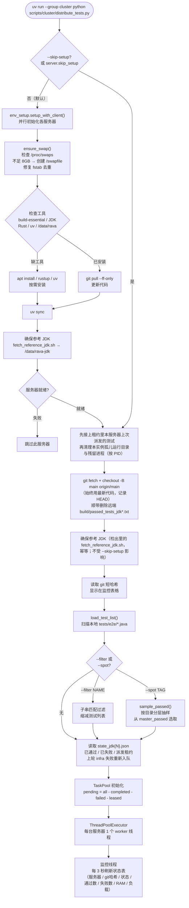
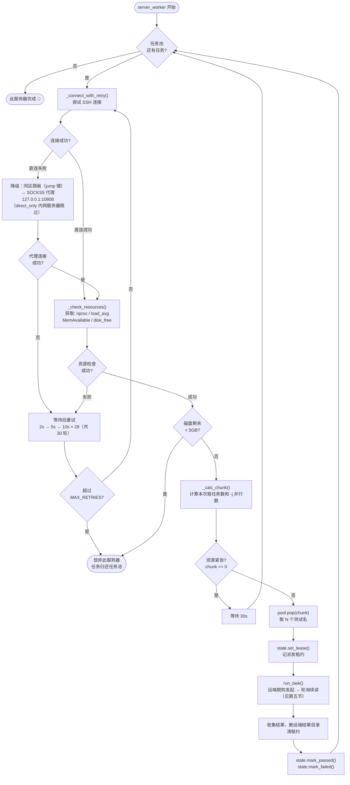
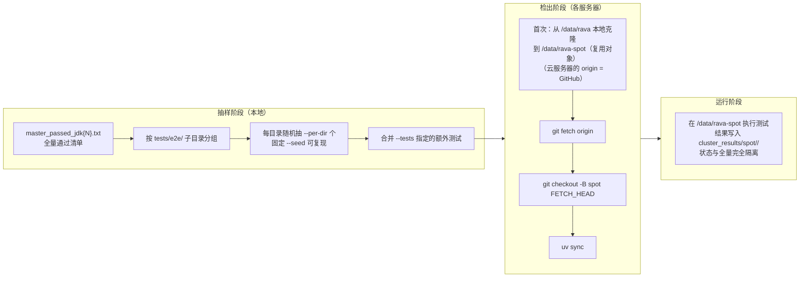
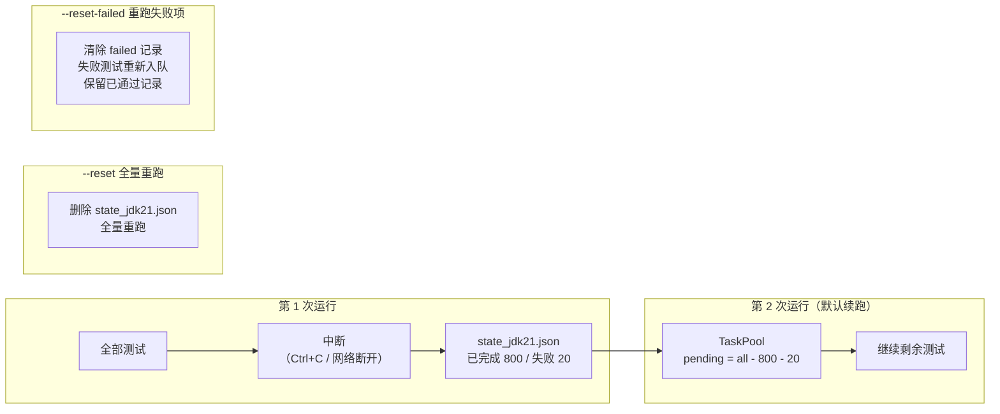
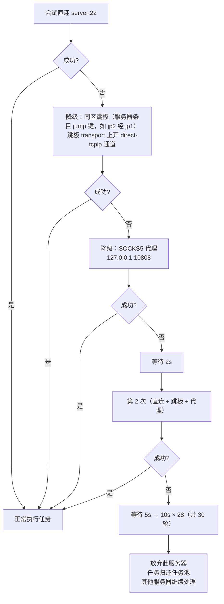

# rava 集群测试（分布式全量 / 抽查 / 作业）— 工作流文档

## 概述

本地 Mac 作为**调度中心**，通过 SSH 控制多台远程服务器并行运行 Java→Rust 转译测试。  
所有命令从本地发出，结果收集到本地，无需手动登录服务器。

依赖：`uv run --group cluster ...`（paramiko，见 pyproject.toml 的 cluster 依赖组）。单元测试：
`uv run --group cluster python -m unittest discover -s tests/unit/cluster`。

服务器选取：不加 `--servers` 时按清单 `pools` 取——全量 / 抽查用 test 池，作业用 job 池；未列入任何池的服务器只在
`--servers` 点名时使用。**现行池（2026-10-08）**：dev 关机维护中（2026-10-07 晚起，等用户通知恢复，清单里 `pools = []`）；
test 池 = 云服务器 jp1、jp2、kr1、kr2、sg1、sg2、us1（各 15G 内存 / 8 核、1 槽，跑着业务）；job 池 = 同 7 台云服务器 + 内网 ubuntu。
云服务器访问不到内部 forgejo，按条目 `repo_url` 从 GitHub 克隆——被测分支须同时推 github。dev 恢复后 test 池改回 dev（16 槽）。
工作流见「十二、工作流与现状」。

```
本地 Mac（调度中心，rava 主检出）
├── scripts/cluster/cluster_config.py    资源阈值、重试策略；读本机服务器清单
├── scripts/cluster/env_setup.py         环境初始化（幂等，自动跳过已安装步骤）
├── scripts/cluster/distribute_tests.py  主调度器（任务池 + 并发 worker）
├── scripts/cluster/analyze_failures.py  失败日志分析报告
├── scripts/cluster/merge_to_main.py     分支合并 + 推送工具
├── cluster_results/                     本地结果汇总目录（gitignore；各 worktree 共用主检出这一份）
└── ~/.config/rava/cluster.toml          服务器清单（本机配置，不入库；格式见 scripts/cluster/cluster.example.toml）

服务器（执行节点，按 pools 分工；2026-10-08 现行）
├── test 池（jp1 / jp2 / kr1 / kr2 / sg1 / sg2 / us1，各 15G、1 槽）：全量 / 抽查
│   └── /data/rava/                 git clone 的项目（云服务器从 GitHub 克隆），测试在此运行
│       └── /data/rava-spot-<tag>/  抽查独立检出目录（与全量隔离）
├── job 池（同 7 台云服务器 + 内网 ubuntu）：单测、闭包、gate 等作业
├── dev（内网 32 核、16 槽）：关机维护中，恢复后回 test 池
└── <remote_dir 所在盘>/rava-jdk/<tag>/   语料参考 JDK（Temurin 21.0.11，见下「语料参考 JDK」）
```

### 语料参考 JDK

语料（e2e、抽查、作业）在所有服务器上使用同一个固定 JDK 构建，与本机生成 expected 的构建同源
（rava `tools/refjdk.toml` 钉 tag + 各平台 URL + sha256，方案见 rava `docs/plans/2026-10-03-reference-jdk-21.md`）。

- **落位**：服务器数据目录 `config.REFJDK_ROOT = /data/rava-jdk`；remote_dir 不在 /data 的服务器以 `refjdk_root` 键覆盖
  （ubuntu：`/mnt/d/workspace/rava-jdk`）。只写数据目录，不动 apt 包、`/usr/lib/jvm`、update-alternatives 与 shell 配置。
- **确保**：每次检出（main / 抽查 / 作业）之后执行该检出里的 `scripts/fetch_reference_jdk.sh`
  （`dist_remote.ensure_reference_jdk`；下载 + sha256 校验 + 解压，已就位即空操作，多实例并发以锁互斥）。
  **不受 `--skip-setup` 影响**——清单随被测提交走。失败则该服务器本轮不派发（作业归还队列）；
  被测提交没有该脚本（参考 JDK 落地之前的旧提交）则跳过，沿用 run_tests.py 旧的 JDK 选择。
- **注入**：e2e 与作业命令前缀 `export RAVA_REFJDK_ROOT=<根>;`，run_tests.py 缺省即用参考构建（未就位报错、不回退系统 JDK）；
  缺省 JDK（`DEFAULT_JDK=21`，须与参考构建主版本一致）不再传 `--jdk`，`--jdk 25` 等其他版本是显式覆盖，
  用系统 JDK，错误日志 `[meta]` 行标「非参考构建」。
- **检查**：`env_setup.py --check-only` 的 `refjdk` 列（`fetch_reference_jdk.sh --check`）；env_setup 第 7 步确保就位。

### GraalVM 参照基线依赖

rava `scripts/graalvm_bench.sh`（JVM / native-image / rava 多条件计时，报告 `docs/reports/2026-10-04-graalvm-baseline.md`）在服务器上的依赖由 `env_setup.py` 第 8 步安装：

- **zlib1g-dev**（apt）：Linux 上 native-image 链接需要 `-lz`，缺失时构建报 `cannot find -lz`。
- **Oracle GraalVM**：`config.GRAALVM_*` 钉版本（21.0.12，与本机 macOS 基线同版）、归档 URL 和 sha256，落到 `<refjdk_root>/graalvm-21/`（与参考 JDK 同盘），只写数据目录，不动 `/usr/lib/jvm`。安装时用 `<refjdk_root>/.graalvm.lock` 互斥，下载校验后原子换入，版本不符就整目录替换。
- 这两项是 `--check-only` 表的 `zlib` / `graalvm` 列，**不计入就绪判定**：缺失不阻塞 e2e 派发，只会让基线作业失败。
- 作业里用 `JAVA_HOME_BENCH=$RAVA_REFJDK_ROOT/graalvm-21 bash scripts/graalvm_bench.sh <用例...>`。

---

## 一、总体架构



---

## 二、启动流程

> 现行池（2026-10-08）：云服务器 7 台各 1 个 worker（1 槽）；云服务器上的检出来源是 GitHub（条目 `repo_url`），
> 下图的 `origin/main` / `git fetch origin <ref>` 在云服务器上即 GitHub 远端——被测提交须先推 github。



---

## 三、单台服务器工作循环

> 每台服务器按 `slots` 起 worker（缺省 1）；现行云服务器均为 1 槽，即一台同时只跑一个测试 / 作业。



---

## 四、资源感知分块策略

每次取任务前 SSH 检查服务器实时资源，动态决定取多少任务、用几个并行：

```
服务器状态                      chunk（本次取多少）   -j（并行数）
──────────────────────────────────────────────────────────────────
RAM 12GB，CPU 10%   → 充裕      取多个任务           -j 2
RAM 6GB，CPU 40%    → 偏紧      取少量任务           -j 1
RAM < 1.5GB         → 内存不足  等待 30s，不取任务
CPU > 60%           → CPU 过载  等待 30s，不取任务
磁盘 < 5GB          → 磁盘不足  退出此服务器
```

> **现行服务器**：云服务器 15G 内存、8 核、跑着业务，1 槽；受限 scope 上限 = 15G − 4G 预留 ≈ 11G。
> 大闭包用例（StockTrans 级）在该上限内可能 OOM，按十二 12.7 判定为资源类失败；重例与 S0 闭包等 dev 恢复。  
> **目标**：测试占用 ≤ 40% CPU + ≤ 4.5GB RAM，为服务器上的其他服务保留资源。  
> **内存上限**：每个 e2e 测试与作业都在 user systemd scope 内运行（`systemd-run --user --scope`），
> cgroup `MemoryMax = 总内存 − 预留`（`MEM_RESERVE_GB=4`，服务器可用 `mem_reserve_gb` 覆盖）、`MemorySwapMax=0`，
> 子进程（rustc / JVM / 生成的二进制）一并计入。超限由内核只杀 scope 内进程，不波及服务器上的 postgres 等服务；
> 结果记为 OOM 失败（上限 / 峰值）。服务器建不了受限 scope 时不在其上运行（`env_setup.py --check-only` 的 memlimit 列）。  
> systemd ≥ 253 的 scope 默认 `OOMPolicy=stop` 会连包装层一起停掉，故在支持时显式设 `OOMPolicy=continue`。  
> **其他 OOM 防护**：所有 Linux 服务器配置 8GB swap（`/swapfile`，测试 scope 内禁用），编译时设置  
> `CARGO_INCREMENTAL=0` + `CARGO_PROFILE_DEV_DEBUG=line-tables-only` 降低 rustc 内存峰值。

---

## 五、测试执行与结果收集（远端脱钩执行）

SSH 断开不丢任务、不丢结果：测试 / 作业在远端以 `setsid nohup` 脱离 SSH 会话运行，本地只轮询。
公共实现在 `remote_run.py`，e2e（`dist_e2e.run_task`）与作业（`dist_job._run_job`）共用。

**远端结果目录** `<工作目录>/build/dist_runs/<run_key>/`，`run_key` = 测试（或作业号）+ JDK + 提交 + 实例标签：

| 文件 | 含义 |
|---|---|
| `cmd.sh` / `runner.sh` | 实际命令（服务器锁前缀 + `mem_limited` 包装）与外壳 |
| `out.log` | 命令全部输出 |
| `pid` | 外壳 PID（原子写） |
| `rc` | 退出码（原子写，先于 done） |
| `done` | 完成标记 |
| `build.log` / `run.log` | e2e 失败时由外壳拷入，供本地收集 |

**流程**：

1. 发起前先探测结果目录：已 done → 直接收结果；进程在跑 → 接上续读；不存在 → 发起。
2. 本地每 `POLL_INTERVAL=12s` 按字节偏移读 `out.log` 增量（单次至多 4MiB），逐行判定
   BUSY / NO_MEMLIMIT / OOM / PASS / FAIL，语义与原来一致。
3. 轮询中断线：重连（直连 → 跳板 → 代理）后从原偏移续读，不重新派发。
4. done 后读 `rc`、拷失败日志，然后删除远端结果目录。e2e 抽查的检出目录仍按原逻辑删除。
5. 超时（`TASK_TIMEOUT` 缺省 1800 秒，`--task-timeout` 覆盖并记入租约，从派发时刻算）：按 PID 结束进程组并记失败。放宽 run_tests 三段超时用 `--run-tests-args "--transpile-timeout 1800 --run-timeout 900 --build-timeout-scale 2"`（须为所检出提交认得的选项），总时限须同步放宽。

**派发租约**：派发前写入 `state_jdk{N}.json` 的 `leases`（作业写在 `summary.json` 的 running 条目），
完成后清除。本地进程被杀或重启后，各服务器 worker 先按租约接上原结果目录，再领新任务。

**异常归还与 infra 失败**：只有远端确认已死且没有 done 时才把任务归还任务池。同一测试归还超过
`MAX_INFRA_RETURNS=3` 次，记为 infra 失败（`infra_failed_jdk{N}.txt`），不计入失败数，下一轮自动重新入队。

**断线熔断**：同一服务器连续断线 `BREAKER_DISCONNECTS=3` 次，冷却 `BREAKER_COOLDOWN=600s` 后再领任务
（监控显示 🧯 断线冷却）。干净跑完一次即清零。

**Ctrl+C**：本地停止轮询。远端只结束本实例自己的运行（按 runner.sh 路径校验后，按 PID 结束进程组 / 会话），
删除其结果目录，租约保留；下次启动在原位置重新发起。不触碰其他实例的运行。

**断线注入（调试）**：环境变量 `RAVA_DIST_INJECT_DROP=N[:label]` 会在第 N 次轮询前主动关闭 SSH transport，
用于验证续读。缺省不设，即关闭。

**会话存活**：logind 为 `KillUserProcesses=no`（未开 linger）。runner 仍在会话 scope 内时，会话保持 closing 而不被回收，
user manager 也因此保留，`systemd-run --user --scope` 建出的受限 scope 不受 SSH 断开影响。

**错误日志文件格式**（`error_logs/TestName_kr2_jdk21.log`）：
```
server: kr2  jdk: 21  git: b57a9f1  time: 2026-09-30 14:23:45

[1/1 TestName] filter: TestName.java
...（run_tests.py 完整输出）

=== build.log ===
...（Rust 编译错误，仅在有内容时追加）

=== run.log ===
...（运行时错误，仅在有内容时追加）
```

---

## 六、本地结果目录结构

```
cluster_results/
│
├── state_jdk21.json               进度状态，跨提交累计续跑（已通过的默认在最新代码上仍通过）
│   ├── passed: {"ABC": {commit, server, time}}   已通过的测试及其运行提交
│   └── failed: {"AStar": {...}}  已失败的测试名 + 服务器 + 次数
│
├── master_passed_jdk21.txt        累计通过清单（= state 通过集，tests/e2e/ 路径，头部注明提交分布）
│
├── by_commit/<commit>/            按运行提交分目录：passed_jdk21.txt / failed_jdk21.txt
│
├── archive/reset_<时间>/          --reset 时归档的 state / 失败清单 / 失败日志 / master
│
├── failed_tests_jdk21.txt         失败汇总
│   TestName  [kr2]  [14:23:45]  .../error_logs/TestName_kr2_jdk21.log
│
├── error_logs/                    失败日志（每个测试一个文件）
│   ├── TestName_kr2_jdk21.log    元信息头 + run_tests 输出（首尾）+ build.log 全部 error 块（含 --> 位置与上下文）
│   │                             + run.log（≤48KB 全文，否则 panic 消息 + 回溯头部）+ build_status.json；单文件 ≤200KB
│   └── ...
│
└── spot/                          抽查模式独立结果目录
    └── <tag>/                     每次抽查的归档（结构同上，与全量完全隔离）
        ├── state_jdk21.json
        ├── master_passed_jdk21.txt
        ├── failed_tests_jdk21.txt
        └── error_logs/
```

> C4 验收全量（`--reset`）等 dev 恢复后在 dev 上跑；dev 关机期间云服务器只做抽查与作业。
> 续跑口径：已通过的测试默认在最新代码上仍通过，重启只跑未通过的（失败的用 --reset-failed 重新入队），
> 服务器始终拉最新代码；只有 --reset 才在最新代码上从头全量。不再使用远端 `--record-passed` 清单
> （残留清单会让 run_tests 跳过测试、被误判失败）。失败日志合并为单文件，避免文件堆积。

---

## 七、抽查模式（--spot）

适用场景：验证新分支没有破坏已通过测试，无需等待全量完成。现行用法是合批验证（十二 12.1）：对合批分支跑各分支待验证清单的并集，
通常 `--per-dir 0 --tests ...`。



```bash
# 基础用法：每目录抽 2 个（默认），检出 claude/my-branch
uv run --group cluster python scripts/cluster/distribute_tests.py --spot v2-check --ref claude/my-branch

# 自定义抽样：每目录抽 5 个，固定种子 42
uv run --group cluster python scripts/cluster/distribute_tests.py --spot v2-check --ref claude/my-branch \
    --per-dir 5 --seed 42

# 抽样 + 额外追加指定测试
uv run --group cluster python scripts/cluster/distribute_tests.py --spot v2-check --ref abc1234 \
    --tests SpecialTest1 SpecialTest2
```

---

## 八、断点续跑与重置



---

## 九、连接失败处理



- 每种方式每轮只连 1 次，建连超时 `CONNECT_TIMEOUT=10s`；最坏约 15 分钟放弃
- `direct_only: True` 的内网服务器（ubuntu、dev）只直连，不降级走跳板或代理
- 现行跳板：jp2 经 jp1（条目 `jump = "jp1"`）；其余云服务器直连失败走 SOCKS5 代理
- 跳板连接按跳板服务器缓存、各线程共用，失效时重建；跳板自身只试直连 → 代理
- 实现在 `dist_conn.py`
- `env_setup.py` 的检查与初始化使用同一套重连逻辑

---

## 十、完整命令参考

```bash
# 工作目录：rava 主检出根目录（服务器清单见 ~/.config/rava/cluster.toml）
# 现行池（2026-10-08）：不加 --servers 时 test 池 = 7 台云服务器，job 池 = 7 台云服务器 + ubuntu；dev 关机待恢复
# 被测分支须先推 origin 与 github（云服务器从 GitHub 检出）
cd ~/dev/workspace/rava

# ── 全量跑批 ──────────────────────────────────────────────────────────────────

# 自动 setup + 运行（首次或续跑）
uv run --group cluster python scripts/cluster/distribute_tests.py

# 跳过环境初始化检查（已确认就绪）
uv run --group cluster python scripts/cluster/distribute_tests.py --skip-setup

# 切换 JDK 版本（非参考构建，仅供实验；缺省 21 = 参考构建 Temurin 21.0.11）
uv run --group cluster python scripts/cluster/distribute_tests.py --jdk 25

# 清除全部进度，从头开始（C4 验收全量等 dev 恢复后再跑）
uv run --group cluster python scripts/cluster/distribute_tests.py --reset

# 只清除失败记录，重新入队（保留已通过记录）
uv run --group cluster python scripts/cluster/distribute_tests.py --reset-failed

# 只运行名称含指定子串的测试（可多个，取并集）
uv run --group cluster python scripts/cluster/distribute_tests.py --filter Approx
uv run --group cluster python scripts/cluster/distribute_tests.py --filter Bell Sort CYKParser

# 查看当前进度
uv run --group cluster python scripts/cluster/distribute_tests.py --status

# 只合并通过清单（不运行测试）
uv run --group cluster python scripts/cluster/distribute_tests.py --merge

# 禁用实时界面（只打印事件日志，适合管道/脚本）
uv run --group cluster python scripts/cluster/distribute_tests.py --no-monitor

# 全部完成后删除服务器 /data/rava 目录
uv run --group cluster python scripts/cluster/distribute_tests.py --cleanup-servers

# ── 抽查模式 ──────────────────────────────────────────────────────────────────

# 基础：每目录抽 2 个，检出 claude/my-branch
uv run --group cluster python scripts/cluster/distribute_tests.py --spot v2-check --ref claude/my-branch

# 自定义抽样参数
uv run --group cluster python scripts/cluster/distribute_tests.py --spot v2-check --ref claude/my-branch \
    --per-dir 5 --seed 42

# 追加额外指定测试
uv run --group cluster python scripts/cluster/distribute_tests.py --spot v2-check --ref abc1234 \
    --tests SpecialTest1 SpecialTest2

# ── 辅助工具 ──────────────────────────────────────────────────────────────────

# 分析失败日志，生成报告
uv run --group cluster python scripts/cluster/analyze_failures.py
uv run --group cluster python scripts/cluster/analyze_failures.py --jdk 25
uv run --group cluster python scripts/cluster/analyze_failures.py --out report.txt

# 合并分支到 main 并推送（自动读取代理环境变量；现行合入走合批，见十二 12.1）
uv run --group cluster python scripts/cluster/merge_to_main.py
uv run --group cluster python scripts/cluster/merge_to_main.py --branch claude/my-branch
uv run --group cluster python scripts/cluster/merge_to_main.py --dry-run

# 环境初始化（单独使用）
uv run --group cluster python scripts/cluster/env_setup.py
uv run --group cluster python scripts/cluster/env_setup.py --servers kr2 sg1   # 只初始化指定服务器
uv run --group cluster python scripts/cluster/env_setup.py --check-only        # 只检查不安装（含 refjdk 列：参考 JDK 是否就位）
```

---

## 十一、子代理工作流：已知失败 / 合批 / 远端 rava

> 2026-10-04 起（提速四项 ① ②）；2026-10-07 起合入改为合批（11.4、十二 12.1），子代理不自发抽查、不入合入队列。
> 所有命令在 rava 主检出根目录下执行；被测提交须先推送 origin 与 github（dev / ubuntu 从内部仓库取，云服务器从 GitHub 取）。

### 11.1 失败日志保全

抽查 / 全量的失败用例，runner 在远端结束前（`post` 片段）把 `<scratch>/logs/build.log`（rustc 全文）、
`logs/<bin>.run.log`、`<scratch>/build_status.json` 复制到运行目录（单文件超 32MB 留首尾各半）；本地
`failure_extract.compose` 从中提取写入 `error_logs/<Test>_<服务器>_jdk21.log`：

- run_tests 输出首尾（≤60KB）；
- `=== build.log 诊断（error 块 N 个，全文 X 字节）===`：每个 `error[...]` 块完整保留（`-->` 位置、源码行、
  note / help），去重，单块 ≤120 行；
- run.log：≤48KB 全文，否则 panic 行 + 消息 + 回溯头部 60 行 + 游离 `stub:` 行；
- build_status.json；单文件总量 ≤200KB（超出的节截断并注明）。

### 11.2 已知失败清单

清单在 rava `docs/known_failures.toml`（集成分支上的版本为准），条目 `test / signature / owner / since / note`。
判定：失败日志含**同名条目**的 signature 子串才算已知；同名而签名不符、OOM、超时一律算新失败。
修好对应失败的分支，在同一提交里删掉条目；新增条目须写明责任分支 / 任务与登记日期。

```bash
uv run --group cluster python scripts/cluster/known_failures.py <spot_tag> [--tests A B ...] [--json]
# 退出码 0 = 完成且无新失败；1 = 有新失败；2 = 未完成（未出结果 / infra 失败）；3 = 清单读取错误
```

### 11.3 子代理自发抽查（tag 前缀）

子代理用**自己的 tag 前缀**（任务代号小写，如 `c1dt2-`、`a3t-`），tag = `<前缀><sha8>`，一个提交一个 tag，
不复用别人的 tag（守护发现同 tag 下有其他提交的结果会直接 blocked）：

```bash
git -C ~/dev/workspace/rava push origin <分支>
uv run --group cluster python scripts/cluster/distribute_tests.py --no-monitor --skip-setup --spot c1dt2-1a2b3c4d \
    --ref <40 位 sha> --per-dir 0 --tests StockTrans TestSerialDefaultSuid HelloWorld
uv run --group cluster python scripts/cluster/known_failures.py c1dt2-1a2b3c4d --tests StockTrans TestSerialDefaultSuid HelloWorld
```

用例名单 = 任务验收用例 + 受影响面的回归用例；失败看 `cluster_results/spot/<tag>/error_logs/`。

### 11.4 合批流程（2026-10-07 起，取代合入队列守护）

1. 子代理只实现：本机 cargo check（十二 12.3）、推分支（origin + github）、在计划文档写待验证清单（用例名单 + 单测范围），完工即停，不自发抽查、不入队。
2. 主会话攒一批完工分支，在 `batch-<月日>`（如 `batch-1008`）上逐个 `git merge --no-ff`，冲突在合批分支上解决，取舍记入所属计划（例：c1d §30.18）。
3. 对合批分支发一次全量单测作业（`--job`，云上 `--job-timeout 14400`）和一次抽查（`--spot <tag> --ref <合批 sha> --per-dir 0 --tests <各分支待验证清单的并集>`）。
4. 判定用 11.2 的已知失败清单（`known_failures.py <tag>`）；新失败在合批分支上修（如 batch-1008 的 b558e0c2），或退回所属分支、下一批再带上。
5. 通过后快进集成分支 rust-closure-analyzer 与 main，推 origin 与 github；已合入的工作分支按合并后清理规则删除。

合入队列守护 `merge_daemon.py` / `merge_queue.py` 保留在 `scripts/cluster/`，但不再使用（试运行记录见 11.7）。

### 11.5 远端 rava（closure / emit / compile 下放）

```bash
uv run --group cluster python scripts/cluster/remote_rava.py closure HelloWorld --ref <sha>                  # closure.json + closure.md
uv run --group cluster python scripts/cluster/remote_rava.py emit TestFoo --ref <sha> -- --perf             # 只生成：rava 输出、生成规模（-- 后原样传给 rava）
uv run --group cluster python scripts/cluster/remote_rava.py compile tests/e2e/01_basics/HelloWorld.java --ref <sha>   # build_status + 错误块
```

阻塞到作业结束，末行打印 `cluster_results/remote_rava/<tag>/summary.md`（缺省 tag `rr-<模式>-<用例>-<sha8>`；
同 tag 已成功不重跑，`--fresh` 强制新跑）。原始产物在 `cluster_results/job/<tag>/01/build/remote_rava/out/`。
退出码 0 = rava 成功；1 = rava 失败（摘要含错误块 / panic）；3 = 作业未完成（infra / 中断，重跑即续接）。
compile 模式与 run_tests 一致分两段（`build --stop-after emit` 再 `rava compile`），rava 步骤撤掉 `CARGO_BUILD_JOBS`
让重型 java_runtime 自动单作业（否则 StockTrans 级闭包在 12GB 上限内 OOM）。同 tag 本地单实例锁：第二个实例
阻塞到前一个结束后直接出摘要，不会重复认领作业。

### 11.6 现状（2026-10-04）

- 四件工具（原在 server_maintenance `dist-tools` 分支，2026-10-07 随全部分发脚本迁入 `scripts/cluster/`）：`failure_extract.py` + `dist_e2e.py`（日志保全）、`known_failures.py`、
  `merge_queue.py` + `merge_daemon.py`、`remote_rava.py`；单元测试 `tests/unit/cluster/test_merge_queue.py`、`tests/unit/cluster/test_merge_daemon.py`。
- 已知失败清单 `docs/known_failures.toml` 已并入集成分支（原在 `dist-known-failures` 分支 3ac45c90）。
- 守护**未启用、不再使用**：2026-10-07 起合入走合批（11.4）；试运行一律 `--dry-run`（演练 worktree `~/dev/workspace/rava_dryrun_wt`）。
- 未覆盖 / 已知局限：
  - 正式路径的推送 / 主仓快进 / 删分支 / push_pending 续推只由单元测试（临时仓库 + 裸远端）覆盖，真实远端未推过；
  - `generator+macros_core`、`generator+rava_coro` 闸门变体未真实跑过（命令与 generator 同构，仅多一步）；
  - 扫描串行：一条条目的闸门（含 heavy_lock 排队，实测 10–30 分钟）期间其他条目不推进；
  - 本地进程被杀后若该 tag 再也不重跑，服务器上的作业 / 抽查检出留着（重跑时按 `checkouts.json` 清理，见 11.7 ⑤）；
  - 兜底：分发脚本每次启动在后台跑 `dist_cleanup.py`，删除 24 小时未改动且无进程在用（cwd / 打开文件）、也不是本地 running 作业租约的 `*-spot-*` 检出，以及 /tmp 下同样过期且无人在用的条目（服务器端 1 小时节流；`--no-cleanup` 关闭；单独 `uv run --group cluster python scripts/cluster/dist_cleanup.py --dry-run` 先看清单）；
  - 让路：`touch cluster_results/job/<tag>/HOLD` 暂停该作业派发排队项（在跑与租约接上的照跑），把空出的服务器让给合入路径的 gate / 单测；删文件即恢复。正在跑的旧分发实例需 `kill -9` 后按原参数重启才生效（重启经租约接上在跑项）；
  - 守护 dry-run 仍尊重集成 worktree 的脏状态（与正式模式一致，协调者在集成 worktree 有未提交改动时条目停在 ready）。

### 11.7 试运行记录（2026-10-04）

格式：输入 → 预期 → 实际（异常与修复）。tag 均以 `tools-` 开头；守护均为 `--dry-run`，集成 worktree、主仓 main、
两远端在整个试运行期间保持协调者自己的提交（3c094c1d），未被守护改动。临时 rava 分支：`tools-trial-ok`
（7b124b9b，注释改动）、`tools-trial-gatefail`（643b3066，`#[cfg(test)]` E0308）、`tools-trial-conflict`（b1ef22a1，
与集成分支同处改 tasks.md）、`tools-trial-doc`（a7ba160a，只改文档），试运行结束后删除。

**① 日志保全**

| 轮 | 输入 | 预期 | 实际 |
|---|---|---|---|
| 1 | `tools-a3t-e0782`：1e6933ee HelloWorld（a3t 回归，E0782） | error 块含 `-->` 位置 | `HelloWorld_us1_jdk21.log` 含完整 E0782 块 `--> java_runtime/src/java/lang/thread_impl.rs:151:18` 与 build_status |
| 2 | `tools-md1-known` StockTrans（7b124b9b） | run.log panic + stub 行 | 13KB，含 `stub: L3 反射分派未覆盖 java/util/ArrayList.<alloc>:()V` 与回溯头 |
| 3 | `tools-md1-known` TestLocaleCurrency | 输出差异 | 7KB，含 `sym=[CN¥]` 差异行 |
| 4 | `tools-md2-new` StockTrans（c1d-t2 24ce8a52） | 生成代码编译错误块 | 两个 `error[E0425]: cannot find value byte2` 块完整（9m40s 编译后） |

**② 已知失败判定**（`known_failures.py`）

| 轮 | 输入 | 预期 | 实际 |
|---|---|---|---|
| 1 | `tools-md1-pass`（HelloWorld 通过） | rc 0 | rc 0，1/1 |
| 2 | `tools-md1-known` | 两条已知，rc 0 | rc 0，StockTrans（ArrayList.<alloc>）、TestLocaleCurrency（CN¥）判已知并标责任方 |
| 3 | `tools-a3t-e0782` | 新失败，rc 1 | rc 1，摘要带 E0782 与日志路径 |
| 4 | 不存在的 tag | 未完成，rc 2 | **异常**：首版判 “0/0 通过” rc 0 → 修复 92d3ad2（无记录且无 `--tests` 时 rc 2）；修复后 4 个 tag 重跑：0 / 0 / 1 / 2 |
| 5 | `tools-md2-new`（同名 StockTrans，签名为 E0425） | 同名签名不符 → 新失败 | 守护 r2-new 判 `同名已知条目签名不符`，blocked |

**③ remote_rava**

| 轮 | 输入 | 预期 | 实际 |
|---|---|---|---|
| rr1 | closure HelloWorld | rc 0 + 闭包统计 | rc 0 |
| rr2 | compile HelloWorld @1e6933ee | rc 1 + E0782 块 | rc 1，摘要含 E0782 |
| rr3 | emit TestLocaleCurrency `--args "--perf"` | perf 行 | **异常**：argparse 拒以 `--` 开头的值 → 改 `--` 透传（90ec669，拼接优先级再修）；之后 rc 0 有 perf |
| rr4/rr5 | compile StockTrans，中途按 PID 杀本地进程 | 重跑接上租约 | 接上成功；但**异常**：rustc OOM（12GB 上限）。原因一：作业模式导出 `CARGO_BUILD_JOBS` 使 driver 重型 crate 单作业失效 → 撤掉（63c7b4b，90ec669 提交信息先于改动，补交）；仍 OOM，原因二：单进程 `build --stop-after compile` 编译期间闭包内存常驻 → 改 emit + `rava compile` 两段（d6f592c） |
| rr6 | compile StockTrans（两段） | rc 0 | rc 0，1022s |
| rr4 附带 | 杀进程时 zsh 未拆分 PID 列表，残留实例与新实例接同一租约 | 单实例 | **异常** → 同 tag 本地锁（95a10db） |
| 终版 1 | 95a10db：closure HelloWorld @3c094c1d | rc 0 | rc 0（465 类），中途按 PID SIGKILL 全链后重跑：`上次在 kr2 运行中，由该服务器接上`，结果正常 |
| 终版 2 | compile HelloWorld @1e6933ee + 20s 后同 tag 第二实例 | 第二实例等锁后出同一摘要 | 第二实例打印 `已有实例在跑，等待…`，两者均 rc 1、同一 summary（E0782） |
| 终版 3 | emit TestLocaleCurrency `-- --perf` @3c094c1d | rc 0 + perf | rc 0，6444 个 rs、perf 合计 42.0s / 峰值 1555MB |
| 补充 | 95a10db 之前起跑的 closure TestLocaleCurrency / emit HelloWorld / compile 断线续接 | 同上 | 均符合（3158 类；perf；E0782 rc 1） |

**④ merge_daemon（--dry-run）**

第 1 轮（queue r1）：

| 条目 | 情形 | 预期 | 实际 |
|---|---|---|---|
| r1-pass | 全部通过（spot 未发起） | 发起 → 等 → 合并 → 闸门 → dry_run_ok | 符合；闸门含锁等待约 29 分钟 |
| r1-known | 只剩已知失败（StockTrans + TestLocaleCurrency） | dry_run_ok，合并信息注明已知 | 符合，1/3 |
| r1-new | 新失败（1e6933ee E0782） | blocked + 摘要 | 符合 |
| r1-conflict | 合并冲突 | merge --abort，blocked | `合并冲突：docs/tasks.md（已 merge --abort）` |
| r1-gatefail | 闸门失败 | reset 回合并前，blocked | `generator-test rc=101 error[E0308]…（已 reset --hard 3c094c1de）` |
| r1-doc | doc-only | 不抽查、核对文件，dry_run_ok | 符合 |
| 进行中 / 断线 | 扫描遇进行中抽查；按 PID SIGTERM gatefail 的抽查 | spot_running；下轮重发 | 符合（第 2 次发起后续跑完成） |
| 基线移动 | 试运行期间协调者推进集成分支到 3c094c1d | 演练以新 HEAD 为基 | 符合 |

第 2 轮（queue r2，`RAVA_DIST_INJECT_DROP=4` 给每个抽查注入一次断线）：

| 条目 | 情形 | 预期 | 实际 |
|---|---|---|---|
| r2-pass | 全部通过 | dry_run_ok | 符合 |
| r2-known | 已知失败 + 断线注入 | 断线重连续读，dry_run_ok | `断线重连 1 次，续读未重派`；dry_run_ok |
| r2-new | c1d-t2 StockTrans E0425（同名已知条目签名不符） | blocked | `新失败 StockTrans: 同名已知条目签名不符 \| error[E0425]…` |
| r2-conflict | 冲突 | blocked | 符合 |
| r2-gatefail | 闸门失败 | blocked + reset | 符合（E0308，reset 3c094c1de） |
| r2-docbad | doc-only 但改代码 | blocked + reset | `doc-only 但改动了非文档文件：generator/crates/driver/src/status.rs` |
| r2-emptytests | 非 doc-only 空名单 | blocked | 符合 |

第 3 轮（queue r3，`RAVA_DIST_INJECT_DROP=3`）：

| 条目 | 情形 | 预期 | 实际 |
|---|---|---|---|
| r3-prelaunched | 子代理已自发抽查（复用已完成的 `tools-md2-pass`） | 不重发抽查，直接合并 + 闸门 | 首轮扫描即判 1/1，闸门干净，dry_run_ok |
| r3-known | 已知失败；抽查进程两次按 PID SIGKILL | 第 2、3 次重发；真实运行中被杀时接上远端租约 | 第 1 次杀在服务器忙等窗口（租约已归还），第 2 次重发正常排队；第 2 次真实运行中（sg2，已经历注入断线并重连）被杀，第 3 次重发 `[sg2] ↪ 接上上次派发的 StockTrans`；期间集成 worktree 有协调者未提交的 tasks.md → `暂缓合并` 保持 ready，协调者提交后（基 fca1643b）自动继续，闸门干净，dry_run_ok |
| r3-new | 复用现成 tag 的新失败（1e6933ee E0782） | blocked | 符合 |
| r3-stale | tag 里是别的提交的结果（`tools-md2-new` 属 24ce8a52） | blocked，不误用 | `spot tag tools-md2-new 已有其他提交的结果：StockTrans@24ce8a52c` |
| r3-conflict | 冲突 | blocked + abort | 符合 |
| r3-gatefail | 复用已通过的抽查，闸门失败 | blocked + reset | 符合 |
| r3-doc | doc-only | dry_run_ok | 符合 |

三轮结束后核对：集成分支近 40 个提交里没有任何 `tools-` 合并；集成 worktree、主仓 main、origin / github 的
rust-closure-analyzer 与 main 均只随协调者自己的提交前进。

**⑤ 本地中断后的服务器残留检出**（断线 / 杀进程类补充）

- 发现：rr4 / rrf / rrg 杀本地进程后，jp1、jp2、kr1、kr2、sg1、sg2、ubuntu 上留有 `*-spot-job-tools-*` 检出——忙等中
  被归还的作业曾被多台服务器检出，重跑时这些服务器没再分到作业，不会删检出。
- 修复 e238ee9：`dist_job` 检出前登记 `cluster_results/job/<tag>/checkouts.json`；该 tag 下次运行在全部作业完成后，
  分到作业的服务器与登记过的服务器都删检出；作业早已全部成功时，启动即按登记逐台删。
- 复跑：`tools-rrg-closure`（已成功）补登记 sg1 / sg2 后重跑 → `[sg1] / [sg2] 已删除残留作业检出`；新 tag
  `tools-co-1` 在 ubuntu 检出后按 PID SIGKILL，重跑时 8 台服务器都检出过，完成后登记清空，逐台列目录确认无残留。
  修复前遗留的检出已按目录逐个删除（只删 `tools-` 前缀）。
- 修复后 remote_rava 再跑一组：`tools-co-1` closure（含杀进程 + 重跑）rc 0；`tools-co-2` compile @1e6933ee rc 1（E0782）；
  `tools-co-3` emit HelloWorld `-- --perf` @34001bde rc 0（2.6s / 287MB）；三者 `checkouts.json` 均为空，
  8 台服务器上没有 `tools-` 检出。

试运行收尾：临时分支 `tools-trial-*` 已从本地、origin、github 删除，`rava_tools_trial` worktree 已移除；
演练 worktree `rava_dryrun_wt` 保留，守护每次演练前自动重置。

## 十二、工作流与现状（2026-10-08）

### 12.1 合批测试

- 子代理只实现：本机 cargo check、推分支、在计划文档写待验证清单，不自发跑测试。
- 主会话把若干完工分支合成验证分支（`batch-<日期>`，如 `batch-1008`），一次跑全量单测加各分支待验证清单抽查的并集。
- 通过后快进集成分支（rust-closure-analyzer）与 main；批内失败转回所属分支修，下一批再带上。
- 步骤见 11.4。

### 12.2 推送

测试分支、合批分支、集成分支、main 都推 origin 与 github（2026-10-08 起 main 也推 github）。服务器从 origin 检出。

### 12.3 本机只跑 cargo check

```bash
cd generator && CARGO_BUILD_JOBS=2 python3 /Users/yuwei/dev/workspace/heavy_lock.py cargo check --release --tests --target-dir ../build/check-target
```

单测、闭包分析（`rava closure`，11.5 `remote_rava.py`）、e2e 都发分布式。

### 12.4 服务器

- dev 关机期间用云服务器 jp1、jp2、kr1、kr2、sg1、sg2、us1，各 15G 内存、1 槽。
- jp2 直连失败时经 jp1 跳板（服务器条目 `jump` 键，见九）。
- 全量单测在云上超过 7200 s，作业用 `--job-timeout 14400`（缺省 3600）。

### 12.5 分发进程存活判定

```bash
pgrep -f "\.venv/bin/python3? .*distribute_tests"
```

作业分发器的进程名为 `python`，抽查为 `python3`，正则两者都覆盖。禁止用 `ps -eo` 判断（macOS 上 `-e` 不列全部进程）。
同一 tag 只留一个实例，多余的 `kill -9`。

### 12.6 子代理等作业

用 Bash `run_in_background` 写 until 循环，盯 `cluster_results/<spot|job>/<tag>/summary.json` 的 status，
或盯 `state_jdk21.json` 的 `leases` 为空。不要只等分发进程的完成通知——实际出现过漏收完成信号的情况。

### 12.7 内存超限判定

失败日志为「could not compile」且无 `E` 码时，先查 `__RAVA_OOM_KILL__` 标记；命中属资源类失败（见四 OOM 防护），不按代码回归处理。
